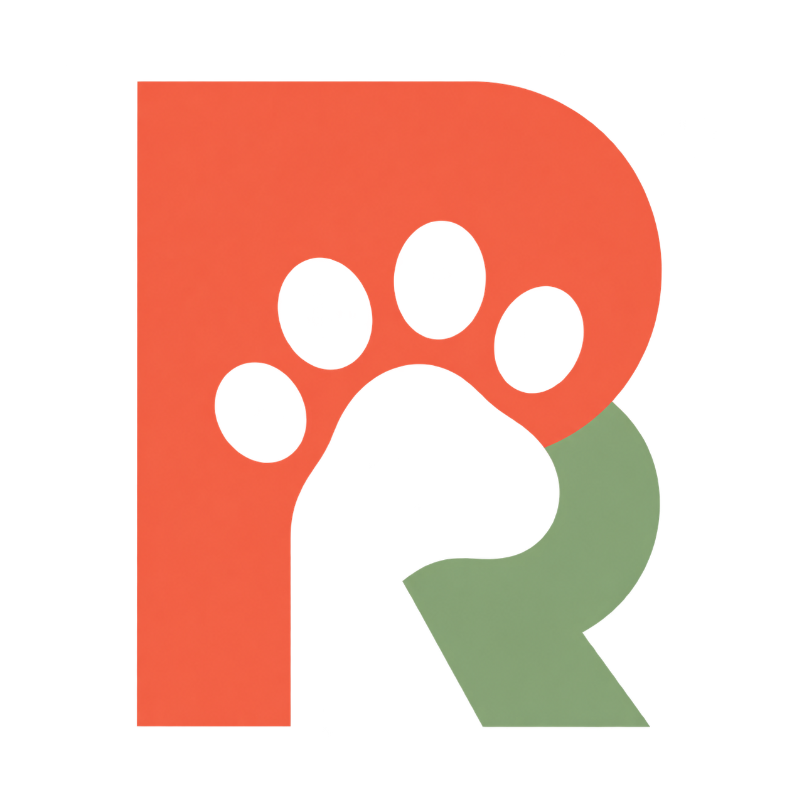
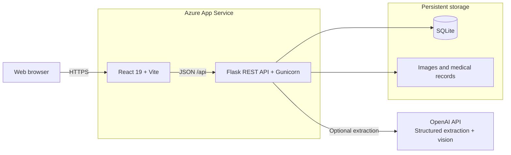

<p align="center">
  
</p>

<h1 align="center">PawRise</h1>

<p align="center">
  <strong>Pet care made clear.</strong><br>
  A full-stack life care journal that keeps pet profiles, care plans, medical records, memories, and community moments in one place.
</p>

<p align="center">
  <a href="https://pawrise-sylvia-20260810-htdvc8eng5bbdscc.canadacentral-01.azurewebsites.net/"><strong>Live Demo</strong></a>
  ·
  <a href="docs/04_SYSTEM_USAGE_GUIDE.md">User Guide</a>
  ·
  <a href="support/API_DOCUMENTATION.md">API Reference</a>
  ·
  <a href="docs/05_ARCHITECTURE.md">Architecture</a>
</p>

<p align="center">
  
  
  
  
  
</p>

## Overview

PawRise helps pet owners replace scattered appointment cards, medication labels, photos, and phone notes with one organized journal. The React frontend and Flask REST API support the complete workflow: create a pet profile, plan upcoming care, turn veterinary instructions into reviewed reminders, save memories, and share pet moments with the community.

The production build is deployed as one same-origin application. Flask serves the compiled frontend and exposes the API under `/api`, while SQLite and uploaded files use persistent storage.

## What PawRise Includes

| Area | What it does |
|---|---|
| **Pet profiles** | Stores each pet's identity, age, species, breed, photo, and care summary. |
| **Care Planner** | Tracks vaccines, checkups, medication, and custom care dates with upcoming, due-soon, and overdue states. |
| **Repeating reminders** | Moves completed care into history and creates the next occurrence from the repeat rule. |
| **Smart medical records** | Accepts PDF, TXT, and image records; extracts medication and follow-up details; and lets the user review everything before creating reminders. |
| **Memories** | Builds a date-based timeline of pet photos and stories. |
| **Community** | Supports pet-photo posts, likes, reports, blocks, and moderator controls. |
| **Dashboard** | Brings together pets, the nearest care items, recent memories, and account activity. |
| **Settings and privacy** | Manages account details, care-notification preferences, data export, and sign-out. |

> Medical extraction is review-first: PawRise never creates a care reminder from an uploaded record until the user confirms the extracted details.

## Product Preview

| Dashboard | Care Planner |
|---|---|
|  |  |

| Smart Records | Community |
|---|---|
|  |  |

More workflows and screenshots are available in the [System Usage Guide](docs/04_SYSTEM_USAGE_GUIDE.md).

## How It Works

1. **Add your pet** — create a profile with the details you want close at hand.
2. **Plan or upload** — add a care date manually or organize instructions from a veterinary visit.
3. **Review and confirm** — verify extracted medical details before turning them into reminders.
4. **Stay on schedule** — complete care items, review history, and let repeating reminders generate the next occurrence.
5. **Save and share** — keep personal memories or post a pet photo to the PawRise community.

## Architecture



### Technology stack

- **Frontend:** React 19, Vite 6, JavaScript, CSS, Lucide React, jsPDF
- **Backend:** Python 3.12, Flask, SQLAlchemy, Flask-Migrate, Flask-JWT-Extended, Flask-CORS
- **Data:** SQLite with foreign keys, indexes, per-user ownership, and cascade rules
- **AI processing:** OpenAI Structured Outputs and vision, with local PDF/TXT extraction and safe fallback behavior
- **Production:** Azure App Service, Gunicorn, same-origin frontend/API delivery, persistent `/home/data` storage
- **Testing:** pytest, Flask test client, in-memory SQLite, and a Vite production build

See [PawRise Architecture](docs/05_ARCHITECTURE.md) for data flows, environments, security boundaries, and deployment details.

## Local Development

### Prerequisites

- Python 3.12+
- Node.js 20+
- pnpm 10+

### 1. Clone the repository

```powershell
git clone https://github.com/lishuyao1024/pawrise.git
cd pawrise
```

### 2. Start the backend

```powershell
cd backend
python -m venv .venv
.venv\Scripts\Activate.ps1
python -m pip install --upgrade pip
python -m pip install -r requirements.txt
Copy-Item .env.example .env
flask --app run.py init-db
python run.py
```

The API runs at `http://127.0.0.1:5000`. Verify it with:

```powershell
Invoke-RestMethod http://127.0.0.1:5000/api/health
```

### 3. Start the frontend

Open another PowerShell window:

```powershell
cd pawrise\frontend
pnpm install
pnpm run dev
```

Open `http://127.0.0.1:5173`. Vite proxies `/api` to the local Flask server, so no frontend environment file is required for the standard setup.

For detailed Windows, macOS/Linux, database, build, and Azure instructions, see [System Setup Instructions](docs/02_SYSTEM_SETUP.md).

## Configuration

Copy `backend/.env.example` to `backend/.env` and update the development secrets:

| Variable | Required | Purpose |
|---|---|---|
| `JWT_SECRET_KEY` | Yes | Signs authentication tokens; replace the example value. |
| `FRONTEND_ORIGINS` | Yes for separate origins | Comma-separated frontend URLs allowed by CORS. |
| `FLASK_DEBUG` | Development only | Enables Flask development diagnostics. |
| `OPENAI_API_KEY` | Optional | Enables AI-assisted image medical-record extraction. |
| `OPENAI_MEDICAL_MODEL` | Optional | Selects the extraction model; the example uses `gpt-5-nano`. |
| `PAWRISE_DATA_DIR` | Production | Chooses the persistent database and upload directory. |
| `VITE_API_BASE_URL` | Optional frontend override | Replaces the default relative `/api` base URL. |

Never commit `.env` or real credentials. Frontend variables prefixed with `VITE_` are embedded in the browser build and must not contain secrets.

## Testing

The recorded validation run completed successfully on August 24, 2026:

- **112 / 112 backend tests passed**
- **0 failures and 0 errors**
- **Frontend production build passed**
- Authentication, user isolation, pet CRUD, reminders, recurrence, history, memories, medical records, uploads, settings, Community, schema upgrades, and dashboard aggregation were covered

Run the backend suite:

```powershell
cd backend
.venv\Scripts\python.exe -m pytest
```

Build the frontend:

```powershell
cd frontend
pnpm install
pnpm run build
```

See [Test Cases](support/TEST_CASES.md), [Test Results](support/TEST_RESULTS.md), and [Production Support and Testing](docs/01_PRODUCTION_SUPPORT_AND_TESTING.md) for the full evidence.

## API Overview

All application endpoints are under `/api`. Protected routes require:

```http
Authorization: Bearer <access-token>
```

| Area | Examples |
|---|---|
| System | `GET /api/health` |
| Authentication | Register, log in, read/update the current user |
| Pets | Create, list, read, update, and delete pet profiles |
| Care | Create, filter, update, complete, delete, and review reminder history |
| Medical records | Upload, inspect, confirm extraction, and create linked reminders |
| Memories | Create, list, edit, and delete timeline entries |
| Community | Posts, likes, reports, blocks, and moderation |
| Settings and dashboard | Notification preferences and aggregated home data |

The complete request and response reference is in [Backend API Documentation](support/API_DOCUMENTATION.md). A ready-to-import collection is available at [PawRise Milestone 2 Postman Collection](support/PawRise_Milestone2.postman_collection.json).

## Production Deployment

The deployed application is available at:

**[https://pawrise-sylvia-20260810-htdvc8eng5bbdscc.canadacentral-01.azurewebsites.net/](https://pawrise-sylvia-20260810-htdvc8eng5bbdscc.canadacentral-01.azurewebsites.net/)**

Production uses the following flow:

1. `pnpm run build` creates the Vite landing and application bundles.
2. Flask serves `frontend/dist` and handles same-origin `/api` requests.
3. `startup.sh` initializes safe database additions and launches Gunicorn on port `8000`.
4. SQLite, uploads, and medical-record files persist under `/home/data` by default.

## Repository Structure

```text
pawrise/
├── backend/
│   ├── app/
│   │   ├── models/          # SQLAlchemy data models
│   │   ├── routes/          # Flask API blueprints
│   │   └── services/        # Medical extraction services
│   ├── tests/               # Automated backend test suite
│   ├── config.py
│   └── run.py
├── frontend/
│   ├── public/              # Public icons and default pet images
│   ├── src/                 # React application, landing page, and styles
│   ├── app.html             # Authenticated application entry
│   └── index.html           # Public landing-page entry
├── docs/                    # Setup, operations, troubleshooting, usage, architecture
├── support/                 # API, database, test, ERD, and Postman evidence
├── deliverables/            # Capstone presentation materials
├── requirements.txt
└── startup.sh
```

## Documentation

### Guides

- [Documentation Home](docs/README.md)
- [Production Support and Testing](docs/01_PRODUCTION_SUPPORT_AND_TESTING.md)
- [System Setup Instructions](docs/02_SYSTEM_SETUP.md)
- [Issue Diagnosis and Resolution](docs/03_ISSUE_DIAGNOSIS_AND_RESOLUTION.md)
- [System Usage Guide](docs/04_SYSTEM_USAGE_GUIDE.md)
- [Architecture](docs/05_ARCHITECTURE.md)

### Technical evidence

- [API Documentation](support/API_DOCUMENTATION.md)
- [Database Design](support/DATABASE_DESIGN.md)
- [Entity-Relationship Diagram](support/er_diagram.png)
- [Medical Records and Care Reminders](support/MEDICAL_RECORDS_AND_REMINDERS.md)
- [Test Cases](support/TEST_CASES.md)
- [Test Results](support/TEST_RESULTS.md)
- [Postman Collection](support/PawRise_Milestone2.postman_collection.json)

## Current Scope

PawRise is a capstone application designed around a single-owner pet-care experience. It uses SQLite and filesystem storage, does not provide multi-clinic workflows, and requires users to review AI-extracted medical information. Those boundaries keep the project understandable, testable, and safe while demonstrating a complete deployed full-stack system.
