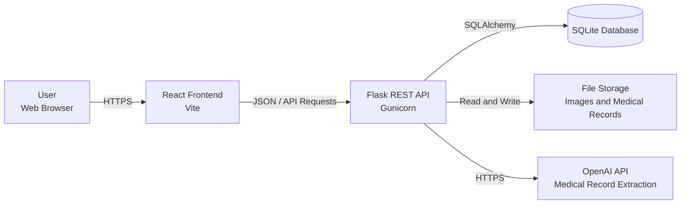

# Production Support and Testing Scenarios

[Back to Documentation Home](README.md)

## 1. Purpose

This document explains how to monitor, troubleshoot, recover, and test the PawRise full-stack application. It is intended for developers, testers, and future maintainers.

PawRise allows users to manage pet profiles, care reminders, medical records, memories, community posts, and notification settings.

## 2. Service Dependency Diagram



### Component Responsibilities

| Component | Technology | Responsibility |
|---|---|---|
| Frontend | React 19 and Vite 6 | Provides the user interface |
| Backend | Python 3.12 and Flask | Handles authentication, validation, and business logic |
| Database | SQLite and SQLAlchemy | Stores application and user data |
| File storage | Local or persistent cloud storage | Stores images and medical records |
| OpenAI API | OpenAI Structured Outputs and vision | Extracts information from medical records |
| Production server | Gunicorn | Runs the Flask application in production |

In local development, the frontend runs at `http://127.0.0.1:5173` and the backend runs at `http://127.0.0.1:5000`.

In production, Flask serves both the compiled frontend and `/api` routes. Persistent database and upload files are stored under `/home/data` in Azure App Service.

## 3. Monitoring and Health Checks

### Backend and Database

Use the following endpoint:

```http
GET /api/health
```

Local URL:

```text
http://127.0.0.1:5000/api/health
```

Production URL:

```text
https://pawrise-sylvia-20260810-htdvc8eng5bbdscc.canadacentral-01.azurewebsites.net/api/health
```

Expected response:

```json
{
  "success": true,
  "message": "PawRise API is running.",
  "data": {
    "service": "pawrise-backend",
    "database": "connected"
  }
}
```

A successful response returns HTTP `200`. If the database is unavailable, the endpoint returns HTTP `503` with the error code `DATABASE_UNAVAILABLE`.

### Monitoring Checklist

| Component | Health Check | Expected Result |
|---|---|---|
| Frontend | Open the application URL | Landing page loads correctly |
| Backend | Request `/api/health` | HTTP 200 |
| Database | Check `/api/health` response | `database: connected` |
| Authentication | Sign in with a test account | Dashboard opens |
| File storage | Upload and retrieve an image | Image remains available |
| Medical extraction | Upload a controlled record | Reviewable draft appears |

### Log Locations

| Environment | Log Location |
|---|---|
| Local backend | Terminal running `python run.py` |
| Local frontend | Terminal running `pnpm run dev` |
| Browser errors | Browser Developer Tools → Console |
| API requests | Browser Developer Tools → Network |
| Automated tests | Terminal running `pytest` |
| Production | Azure App Service → Log stream |

Gunicorn writes production access and error logs to standard output and standard error.

## 4. Common Incidents and Recovery Steps

### 4.1 Database Connection Failure

**Symptoms**

- `/api/health` returns `503`.
- Login and data operations fail.
- Logs contain database or filesystem errors.

**Recovery**

1. Review the backend logs.
2. Verify `DATABASE_URL`.
3. Confirm the database directory exists and is writable.
4. Check available disk space.
5. Back up `pawrise.db`.
6. Run:

   ```powershell
   flask --app run.py init-db
   ```

7. Restart the backend.
8. Confirm `/api/health` returns HTTP `200`.

Do not delete the database as the first recovery step.

### 4.2 Backend Service Crash

**Symptoms**

- HTTP `500`, `502`, or `503`
- `/api/health` does not respond
- Frontend displays a network error

**Recovery**

1. Review the first exception in the server logs.
2. Verify Python dependencies:

   ```powershell
   python -m pip install -r backend/requirements.txt
   ```

3. Confirm required environment variables.
4. Run the backend tests.
5. Restart the service.
6. If necessary, roll back to the last working release.
7. Repeat the health check and login test.

### 4.3 Frontend Build Missing

**Symptoms**

- The application returns `FRONTEND_NOT_BUILT`.
- Static assets return `404`.

**Recovery**

```powershell
cd frontend
pnpm install
pnpm run build
```

Confirm that `frontend/dist/index.html` and `frontend/dist/assets/` exist, then restart or redeploy the application.

### 4.4 Frontend Cannot Reach the Backend

**Recovery**

1. Check `/api/health`.
2. Inspect the browser Network panel.
3. Verify `VITE_API_BASE_URL`.
4. Verify `FRONTEND_ORIGINS`.
5. Rebuild the frontend after changing a `VITE_` variable.
6. Restart both services.

### 4.5 Upload Failure

**Recovery**

1. Confirm the file is no larger than 5 MB.
2. Confirm the file type is supported.
3. Verify storage-directory permissions.
4. Check available disk space.
5. Upload and retrieve a small test file.

### 4.6 OpenAI Extraction Failure

**Recovery**

1. Verify `OPENAI_API_KEY` and `OPENAI_MEDICAL_MODEL`.
2. Review backend warnings.
3. Confirm outbound network access.
4. Retry with a clearer image.
5. Use the local fallback for text documents.
6. Review all extracted information before confirmation.

Other application features remain available when OpenAI is unavailable.

### 4.7 Authentication Failure

JWT access tokens expire after eight hours.

1. Sign out and sign in again.
2. Confirm requests contain the Bearer token.
3. Verify that `JWT_SECRET_KEY` is configured and has not unexpectedly changed.

## 5. Testing Environment and Summary

Testing was completed on August 24, 2026.

| Item | Value |
|---|---|
| Operating system | Windows |
| Python | 3.12.13 |
| Flask | 3.1.3 |
| SQLAlchemy | 2.0.51 |
| pytest | 8.4.2 |
| Node.js | 24.18.0 |
| pnpm | 11.19.0 |
| Database | SQLite in-memory test database |
| Git commit | `b08ad9b` |

### Overall Results

| Test Type | Result |
|---|---|
| Unit tests | PASS |
| Integration tests | PASS |
| End-to-end scenarios | PASS |
| Manual tests | PASS |
| Frontend production build | PASS |
| Post-deployment smoke tests | PASS |

## 6. Unit and Integration Tests

Backend test command:

```powershell
cd backend
.venv\Scripts\python.exe -m pytest
```

Actual result:

```text
112 passed in 87.92s
```

### Unit Test Results

| Test Area | Expected Result | Actual Result | Status |
|---|---|---|---|
| Medical extraction | Structured medical data is returned | Structured draft returned | PASS |
| OpenAI failure fallback | Local extraction rules are used | Local fallback activated | PASS |
| Vision extraction | Image data is converted into structured fields | Medication and follow-up returned | PASS |
| Monthly recurrence | Month-end dates remain valid | February dates calculated correctly | PASS |
| Leap-year recurrence | Leap and non-leap years are handled | Correct dates returned | PASS |

### Integration Test Results

| Area | Tests | Result |
|---|---:|---|
| Authentication and profile | 12 | PASS |
| Community | 8 | PASS |
| Dashboard | 4 | PASS |
| Health check | 1 | PASS |
| Medical records | 11 | PASS |
| Memories | 8 | PASS |
| Database models | 1 | PASS |
| Pets | 11 | PASS |
| Reminders | 40 | PASS |
| Database schema | 6 | PASS |
| Settings | 4 | PASS |
| Uploads | 3 | PASS |
| AI extraction | 3 | PASS |
| **Total** | **112** | **PASS** |

The automated tests verified:

- Registration, login, and JWT protection
- Per-user data isolation
- Pet, reminder, memory, and settings CRUD
- Medical-record extraction and confirmation
- Repeating reminder generation
- Community sharing, likes, reports, and blocks
- Database relationships and cascade deletion
- Upload validation
- API and database health

## 7. Frontend Build Validation

Command:

```powershell
cd frontend
pnpm run build
```

Actual result:

```text
2043 modules transformed
Production build completed successfully in 12.53 seconds
```

Status: **PASS**

## 8. End-to-End and Manual Test Results

| Test ID | Scenario | Expected Result | Actual Result | Status |
|---|---|---|---|---|
| E2E-01 | Register, log in, and create a pet | Pet remains after refresh and login | Pet persisted correctly | PASS |
| E2E-02 | Create and complete a repeating reminder | Completed item enters history and next item appears | Workflow completed correctly | PASS |
| E2E-03 | Upload and confirm a medical record | Medical record creates selected reminders | Record and reminders created | PASS |
| E2E-04 | Add and share a memory | Shared post appears in Community | Post displayed correctly | PASS |
| E2E-05 | Update profile and settings | Changes remain after refresh | Changes persisted | PASS |

### Manual Test Cases

| Test ID | Scenario | Expected Result | Actual Result | Status |
|---|---|---|---|---|
| MT-01 | Open the landing page | Page and assets load | Page loaded correctly | PASS |
| MT-02 | Register and log in | Dashboard opens | Dashboard opened | PASS |
| MT-03 | Create and edit a pet | Updated pet appears | Pet saved and updated | PASS |
| MT-04 | Create and complete a reminder | Reminder moves to history | Reminder completed correctly | PASS |
| MT-05 | Upload a medical record | Extraction draft appears | Draft displayed for review | PASS |
| MT-06 | Add a memory with an image | Memory appears in timeline | Memory displayed correctly | PASS |
| MT-07 | Share a memory | Community post appears | Post appeared correctly | PASS |
| MT-08 | Update notification settings | Settings remain after refresh | Settings persisted | PASS |
| MT-09 | Use the application on a narrow screen | Interface remains usable | Layout remained responsive | PASS |
| MT-10 | Upload an invalid file | Clear validation message appears | Upload was rejected correctly | PASS |

## 9. Post-Deployment Smoke Tests

| Test ID | Validation | Expected Result | Actual Result | Status |
|---|---|---|---|---|
| ST-01 | Open production application | Landing page loads | Page loaded correctly | PASS |
| ST-02 | Request `/api/health` | HTTP 200 and database connected | Expected response returned | PASS |
| ST-03 | Log in using a test account | Dashboard opens | Login completed | PASS |
| ST-04 | Create and retrieve a pet | Pet persists after refresh | Pet persisted | PASS |
| ST-05 | Create and complete a reminder | Reminder moves to history | Workflow completed | PASS |
| ST-06 | Upload and retrieve an image | Image remains available | Image retrieved | PASS |
| ST-07 | Process a medical record | Reviewable draft appears | Draft appeared | PASS |
| ST-08 | Review browser and server logs | No critical errors | No critical errors found | PASS |

## 10. Final Assessment

PawRise passed all automated, manual, end-to-end, build, and post-deployment validation scenarios.

Final results:

```text
Backend automated tests: 112 passed
Frontend production build: PASS
End-to-end scenarios: PASS
Manual testing: PASS
Post-deployment smoke testing: PASS
Overall status: READY FOR RELEASE
```
