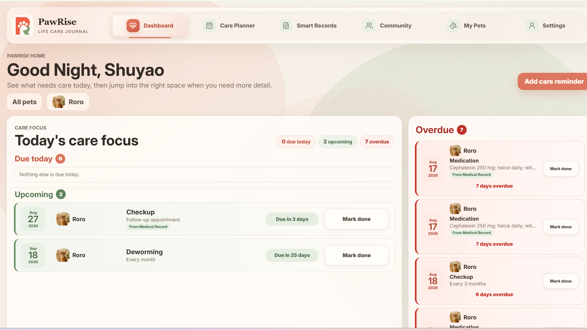
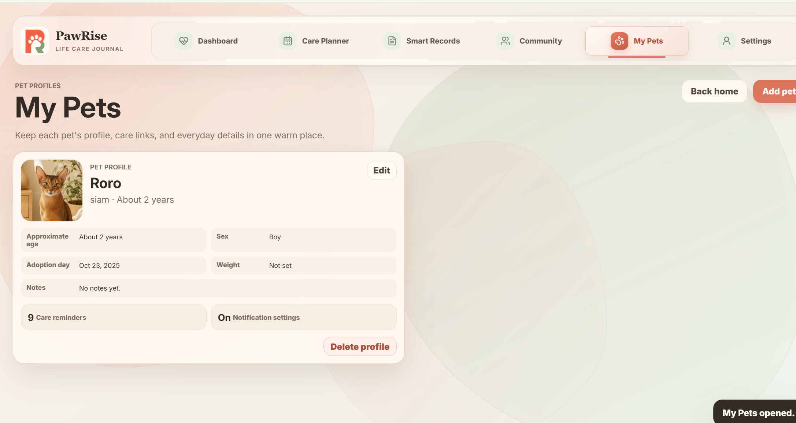
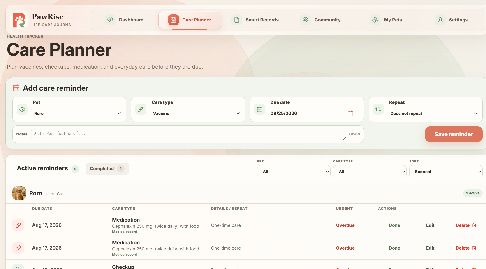
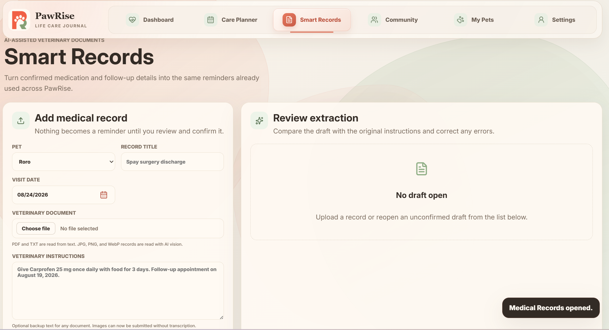
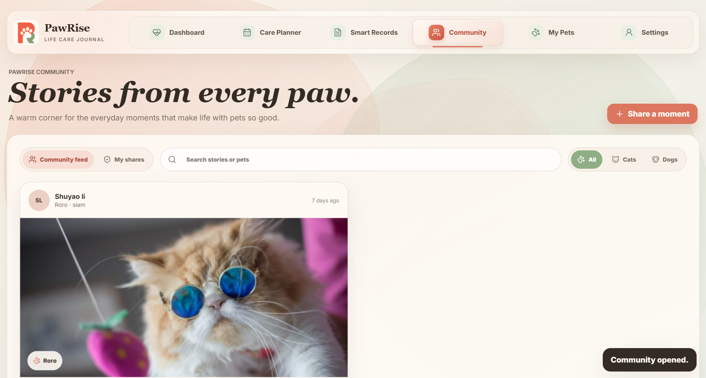

# PawRise System Usage Guide

[Back to Documentation Home](README.md)

## 1. About PawRise

PawRise is a pet-care application that helps pet owners organize:

- Pet profiles
- Care reminders
- Completed care history
- Veterinary medical records
- Pet memories
- Community posts
- Notification preferences

No technical knowledge is required to use PawRise.

## 2. Accessing PawRise

### Application URLs

| Environment | URL |
|---|---|
| Local development | `http://127.0.0.1:5173` |
| Production | [Open PawRise Production](https://pawrise-sylvia-20260810-htdvc8eng5bbdscc.canadacentral-01.azurewebsites.net/) |

### Test Account

Evaluators can register their own test account on the production application. No pre-created credentials are required.

To create a test account:

1. Open [PawRise Production](https://pawrise-sylvia-20260810-htdvc8eng5bbdscc.canadacentral-01.azurewebsites.net/).
2. Select **Create an account**.
3. Enter a name and an unused email address.
4. Create a password containing at least eight characters.
5. Select **Create account**.

Use a disposable test email address and do not reuse an important personal password. Shared passwords are not published or committed to Git.

## 3. Signing In and Out

### Sign In

1. Open PawRise.
2. Select **Log in**.
3. Enter the registered email address.
4. Enter the account password.
5. Select **Continue**.
6. The PawRise dashboard opens after successful authentication.

### Sign Out

1. Select **Settings** from the navigation menu.
2. Select **Log out**.
3. The application returns to the login screen.

A login session expires after eight hours. If PawRise asks the user to authenticate again, sign in using the same email address and password.

## 4. Application Navigation

| Navigation Item | Purpose |
|---|---|
| Dashboard | View pets, active reminders, recent activity, and care summaries |
| Care Planner | Create, edit, complete, delete, filter, and review care reminders |
| Smart Records | Upload and review veterinary medical records |
| Community | Share pet memories and view other members' posts |
| My Pets | Create and manage pet profiles |
| Settings | Update profile information, notification preferences, and account options |



*The Dashboard summarizes upcoming and overdue care across the user's pets.*

## 5. Main User Workflows

### 5.1 Create a Pet Profile

1. Select **My Pets**.
2. Select **Add pet**.
3. Upload a pet photo if desired.
4. Enter the pet's name.
5. Select **Cat** or **Dog**.
6. Enter the breed and sex.
7. Enter either the birthday or approximate age.
8. Add the adoption date, weight, and notes if available.
9. Select **Save pet**.
10. Confirm that the pet appears under **My Pets**.

To change a profile, select **Edit**, update the information, and save again.

Deleting a pet also removes its related active records. Review the confirmation message carefully before deleting a profile.



### 5.2 Create a Care Reminder

1. Select **Care Planner**.
2. Select **Add care reminder**.
3. Choose a pet.
4. Select the care type.
5. Enter the due date.
6. Choose whether the reminder repeats.
7. Add optional notes.
8. Save the reminder.
9. Confirm that it appears in the active-care list.

Available care types include veterinary care, medication, grooming, activity, and custom care.

### Complete a Reminder

1. Open **Care Planner**.
2. Find the active reminder.
3. Select **Complete**.
4. The reminder moves to the completed-care history.

If the reminder repeats, PawRise automatically creates the next occurrence.

Use the **Active** and **Completed** tabs to switch between current reminders and care history.



### 5.3 Upload a Medical Record

1. Select **Smart Records**.
2. Choose the pet connected to the record.
3. Enter a record title.
4. Enter the veterinary visit date.
5. Upload a supported document or paste the veterinary instructions.
6. Select **Extract for review**.
7. Wait for the review draft to appear.

Supported document types are:

```text
PDF, TXT, JPG, JPEG, PNG, and WebP
```

PDF and TXT documents are read from their text. Image records are processed using AI vision.

### Review and Confirm the Record

1. Compare the extracted information with the original veterinary document.
2. Correct any medication name, dose, frequency, duration, or follow-up date.
3. Clear the **Include** option for any item that should not become a reminder.
4. Select **Confirm and create reminders**.
5. Open **Care Planner** to view the new linked reminders.

PawRise does not create reminders until the user confirms the review draft.

PawRise organizes veterinary instructions but does not diagnose conditions, calculate medication doses, or replace professional veterinary advice.



### 5.4 Share a Pet Memory

1. Select **Community**.
2. Select **Share a moment**.
3. Choose a pet.
4. Upload a photo.
5. Enter a title.
6. Write a short description of the memory.
7. Select **Share with Community**.
8. Confirm that the post appears in the Community feed.

A shared moment is visible to other authenticated PawRise members.

### Community Actions

Users can:

- Like a post
- Search posts
- Filter the feed
- View their own shared posts
- Hide a post
- Report inappropriate content
- Block another user
- Delete a post they own

Deleting a Community post does not automatically delete the original private memory.



### 5.5 Update Account Settings

1. Select **Settings**.
2. Update the account name or profile image if needed.
3. Review the notification preferences.
4. Change the reminder lead time.
5. Save the settings.
6. Refresh the page and confirm that the changes remain.

Settings are stored separately for each user.

## 6. Known Limitations and User Gotchas

| Limitation | User Impact | Workaround |
|---|---|---|
| Password-reset email is not connected | The **Forgot password** button cannot send a reset email | Contact the project team |
| Email and push-notification delivery is not implemented | Preferences can be saved, but external messages are not sent | Check the Care Planner and Dashboard directly |
| Upload limit is 5 MB | Larger documents and images are rejected | Compress or resize the file |
| Pet type selection is limited to cats and dogs | Other animal types cannot be selected | Use notes to record additional information |
| AI extraction may make mistakes | Medical information may be incomplete or incorrect | Compare every field with the original document |
| AI image extraction requires OpenAI availability | Image processing may fail during an API outage | Retry later or paste the instructions as text |
| Sessions expire after eight hours | The user must sign in again | Log in using the same account |
| Community posts are visible to members | Shared content is not private | Do not share sensitive information |
| Deleting a pet affects related records | Pet-related information may be removed | Review the confirmation before deleting |

## 7. Privacy and Safety

Users should not upload:

- Payment information
- Government identification
- Unrelated private documents
- Another person's confidential information

Medical-record extraction is provided for organization only. Users must compare extracted information with the original veterinary instructions before confirming it.

For urgent medical concerns, contact a licensed veterinarian.

## 8. Getting Support

Report technical problems through the PawRise GitHub repository:

```text
https://github.com/lishuyao1024/pawrise/issues
```

Include the following information:

- Page where the problem occurred
- Steps that caused the problem
- Expected behavior
- Actual behavior
- Browser and device
- Date and approximate time
- Screenshot of the error, if available

Do not include passwords, API keys, authentication tokens, or private medical information in a support request.
