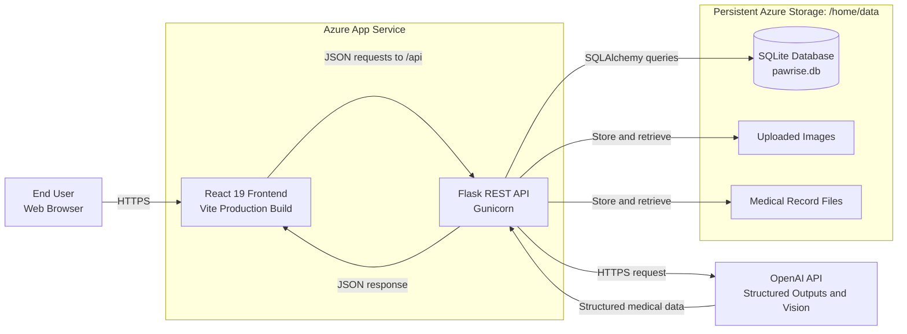
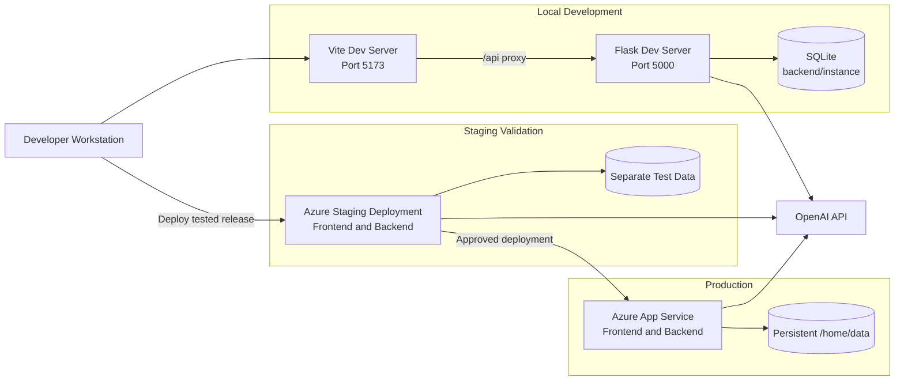
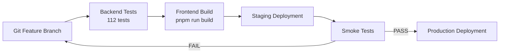

# PawRise Architecture

[Back to Documentation Home](README.md)

## 1. Architecture Overview

PawRise uses a client-server architecture with a React frontend, Flask REST API, SQLite database, persistent file storage, and an external OpenAI API.

In production, the compiled React frontend and Flask API are hosted together in Azure App Service. This allows the frontend to communicate with the backend through same-origin `/api` requests.

## 2. High-Level Architecture Diagram



## 3. Component Responsibilities

| Component | Technology | Role |
|---|---|---|
| Web browser | Chrome, Edge, or Firefox | Displays PawRise and accepts user input |
| Frontend | React 19, Vite 6, JavaScript, CSS | Provides pages, forms, navigation, and client-side validation |
| Backend API | Python 3.12, Flask | Handles authentication, validation, business logic, and API responses |
| Production server | Gunicorn | Runs the Flask application in Azure |
| Database | SQLite, SQLAlchemy | Stores users, pets, reminders, memories, records, settings, and Community data |
| File storage | Local filesystem or `/home/data` | Stores images and medical documents |
| OpenAI API | Structured Outputs and vision | Extracts medication and follow-up information from medical records |
| Azure App Service | Linux and Python 3.12 | Hosts the production frontend and backend |

## 4. Communication Flows

### 4.1 Authentication Flow

```text
User
  → React login form
  → POST /api/auth/login
  → Flask validates credentials
  → Flask returns a JWT access token
  → Frontend includes the token in protected requests
```

Protected API requests use:

```http
Authorization: Bearer <access-token>
```

### 4.2 Application Data Flow

```text
User action
  → React frontend
  → Flask API
  → Input validation
  → SQLAlchemy
  → SQLite database
  → JSON response
  → Updated user interface
```

This flow is used for pets, reminders, memories, settings, medical records, and Community features.

### 4.3 File Upload Flow

```text
User selects a file
  → Frontend sends multipart form data
  → Flask validates authentication, size, extension, and MIME type
  → File is stored in persistent storage
  → File URL is returned to the frontend
```

The maximum upload request size is 5 MB.

### 4.4 Medical Record Flow

```text
User uploads a medical record
  → Flask validates and stores the document
  → PDF/TXT text is extracted locally, or an image is sent to OpenAI
  → Structured draft is returned
  → User reviews and corrects the draft
  → User confirms selected items
  → Flask creates linked care reminders
  → SQLite stores the record and reminders
```

No reminder is created before user confirmation.

## 5. Environment Architecture



### Environment Details

| Environment | Frontend | Backend | Database and Storage | Purpose |
|---|---|---|---|---|
| Local | Vite development server | Flask development server | `backend/instance/` | Development and automated testing |
| Staging | Compiled Vite frontend | Gunicorn and Flask | Separate test data | Deployment and smoke-test validation |
| Production | Compiled Vite frontend | Gunicorn and Flask | Persistent `/home/data` | Live user access |

Staging should use separate data and environment variables so testing does not affect production users.

## 6. Hosting and Deployment Flow



The production startup process:

1. Creates persistent upload directories.
2. Initializes or updates the database.
3. Starts Gunicorn on port `8000`.
4. Serves the compiled frontend and `/api` routes.

## 7. Security Boundaries

| Area | Protection |
|---|---|
| Authentication | JWT access tokens |
| Passwords | Secure password hashing |
| User data | Database queries scoped to the authenticated user |
| CORS | Only configured frontend origins are accepted |
| Uploads | Authentication, extension, MIME-type, and size validation |
| Secrets | Stored in environment variables, not Git |
| Medical extraction | User review required before reminders are created |
| Production transport | HTTPS |

## 8. Architecture Limitations

- SQLite is appropriate for the current capstone deployment but is not intended for high-volume horizontal scaling.
- Production database and upload files depend on persistent `/home/data` storage.
- OpenAI image extraction depends on external API availability.
- Text-based medical records can use local fallback extraction if OpenAI is unavailable.
- Email delivery and push notifications are not currently connected.

This architecture supports the current PawRise release while keeping the frontend, backend, database, storage, and external services clearly separated.
