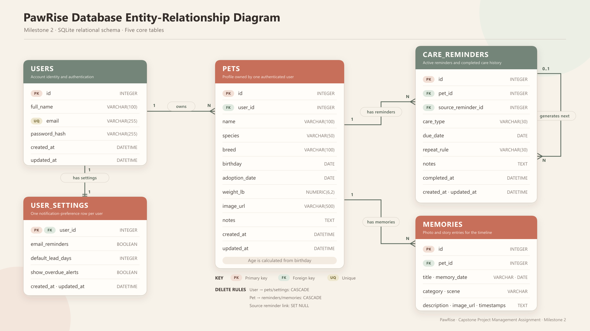

# PawRise Database Design

## 1. Document Purpose

This document defines the relational database design for the PawRise Milestone 2 backend. The database supports authenticated user accounts, pet profiles, care reminders and history, pet memories, notification settings, and dashboard summaries.

The design corresponds to the core APIs defined in [API_DOCUMENTATION.md](API_DOCUMENTATION.md).

## 2. Database Technology

| Item | Selection |
|---|---|
| Database | SQLite |
| Backend language | Python |
| Web framework | Flask |
| Object-relational mapper | Flask-SQLAlchemy |
| Migration tool | Flask-Migrate |
| Local database file | `backend/instance/pawrise.db` |

SQLite is appropriate for the first PawRise release because it is lightweight, requires no separate database server, and is easy to demonstrate locally. SQLAlchemy keeps the application models portable if the project later moves to PostgreSQL or another relational database.

The local `.db` file is excluded from Git because it contains runtime data. SQLAlchemy models, migrations, initialization instructions, and optional seed data are committed so another user can recreate the database.

## 3. Entity Relationship Diagram



The standalone PNG identifies all primary keys, foreign keys, core attributes, relationship cardinalities, and delete behaviors used by the Milestone 2 database.

## 4. Relationship Summary

| Parent | Child | Relationship | Delete behavior |
|---|---|---|---|
| `users` | `pets` | One user can own many pets | Delete pets when the owning user is deleted |
| `users` | `user_settings` | One user has exactly one settings row | Delete settings when the user is deleted |
| `pets` | `care_reminders` | One pet can have many reminders | Delete reminders when the pet is deleted |
| `pets` | `memories` | One pet can have many memories | Delete memories when the pet is deleted |
| `care_reminders` | `care_reminders` | A completed repeating reminder may generate the next reminder | Keep the generated reminder if its source link is cleared |

All protected database queries must be scoped to the authenticated user. A user must never be able to read or modify another user's records.

## 5. Table Definitions

### 5.1 `users`

Stores login and account identity information.

| Column | SQLite type | Required | Key/default | Description |
|---|---|---:|---|---|
| `id` | INTEGER | Yes | Primary key, auto-increment | Internal user identifier |
| `full_name` | VARCHAR(100) | Yes | — | User's display name |
| `email` | VARCHAR(255) | Yes | Unique, indexed | Normalized login email |
| `password_hash` | VARCHAR(255) | Yes | — | Secure password hash |
| `created_at` | DATETIME | Yes | Current UTC time | Record creation time |
| `updated_at` | DATETIME | Yes | Current UTC time | Last account update time |

#### Constraints

- `full_name` must not be blank.
- `email` must be normalized to lowercase before storage.
- `email` must be unique.
- Plain-text passwords must never be stored.
- Passwords must contain at least eight characters before hashing.

#### Example Row

```json
{
  "id": 1,
  "full_name": "Shuyao Li",
  "email": "shuyao@example.com",
  "password_hash": "<secure-hash>",
  "created_at": "2026-07-24T20:00:00Z",
  "updated_at": "2026-07-24T20:00:00Z"
}
```

### 5.2 `pets`

Stores pet profiles. Every pet belongs to one user.

| Column | SQLite type | Required | Key/default | Description |
|---|---|---:|---|---|
| `id` | INTEGER | Yes | Primary key, auto-increment | Internal pet identifier |
| `user_id` | INTEGER | Yes | Foreign key → `users.id`, indexed | Owner of the pet |
| `name` | VARCHAR(100) | Yes | — | Pet name |
| `species` | VARCHAR(50) | Yes | — | Animal type, such as Cat or Dog |
| `breed` | VARCHAR(100) | No | NULL | Pet breed |
| `birthday` | DATE | No | NULL | Date of birth |
| `adoption_date` | DATE | No | NULL | Adoption date |
| `weight_lb` | NUMERIC(6,2) | No | NULL | Current weight in pounds |
| `image_url` | VARCHAR(500) | No | NULL | Stored image path or URL |
| `notes` | TEXT | No | NULL | Profile notes |
| `created_at` | DATETIME | Yes | Current UTC time | Record creation time |
| `updated_at` | DATETIME | Yes | Current UTC time | Last profile update time |

#### Constraints

- `name` and `species` must not be blank.
- `birthday` and `adoption_date` cannot be future dates.
- `weight_lb` must be greater than zero when supplied.
- The API calculates age from `birthday`; age is not stored as editable text.
- The authenticated user must own the pet before accessing or modifying it.

#### Example Row

```json
{
  "id": 1,
  "user_id": 1,
  "name": "Dami",
  "species": "Cat",
  "breed": "Siamese",
  "birthday": "2023-04-18",
  "adoption_date": "2023-06-12",
  "weight_lb": 9.2,
  "image_url": "/uploads/pets/dami-profile.png",
  "notes": "Gentle, vocal, and happiest near the window."
}
```

### 5.3 `care_reminders`

Stores future care reminders and completed Care History items in the same table. A completed reminder is identified by a non-null `completed_at`.

| Column | SQLite type | Required | Key/default | Description |
|---|---|---:|---|---|
| `id` | INTEGER | Yes | Primary key, auto-increment | Internal reminder identifier |
| `pet_id` | INTEGER | Yes | Foreign key → `pets.id`, indexed | Pet receiving the care |
| `source_reminder_id` | INTEGER | No | Self foreign key → `care_reminders.id` | Previous occurrence that generated this reminder |
| `care_type` | VARCHAR(30) | Yes | — | Type of planned care |
| `due_date` | DATE | Yes | Indexed | Planned care date |
| `repeat_rule` | VARCHAR(30) | Yes | Default `none` | Recurrence rule |
| `notes` | TEXT | No | NULL | Reminder notes |
| `completed_at` | DATETIME | No | NULL, indexed | Time the reminder was completed |
| `created_at` | DATETIME | Yes | Current UTC time | Record creation time |
| `updated_at` | DATETIME | Yes | Current UTC time | Last reminder update time |

#### Allowed `care_type` Values

```text
vaccine
deworming
checkup
medication
weight
other
```

#### Allowed `repeat_rule` Values

```text
none
monthly
every_2_months
every_3_months
every_6_months
yearly
```

#### Status Calculation

The database does not store an editable `status` column. The backend calculates status when returning API data:

```text
If completed_at is not null:
    status = completed
Else if due_date is before today:
    status = overdue
Else if due_date is between today and today + default_lead_days:
    status = due_soon
Else:
    status = upcoming
```

This avoids stale or contradictory data such as a past due date stored with an `upcoming` status.

#### Repeating Reminder Completion

Completing a repeating reminder uses one database transaction:

1. Set the current reminder's `completed_at`.
2. Calculate the next due date from `repeat_rule`.
3. Create a new active reminder with `completed_at = NULL`.
4. Set the new reminder's `source_reminder_id` to the completed reminder ID.
5. Commit both changes together.

If any step fails, the transaction is rolled back.

#### Example Active Row

```json
{
  "id": 1,
  "pet_id": 1,
  "source_reminder_id": null,
  "care_type": "medication",
  "due_date": "2026-08-24",
  "repeat_rule": "every_2_months",
  "notes": "Flea prevention refill.",
  "completed_at": null
}
```

#### Example Completed Row

```json
{
  "id": 1,
  "pet_id": 1,
  "source_reminder_id": null,
  "care_type": "medication",
  "due_date": "2026-08-24",
  "repeat_rule": "every_2_months",
  "notes": "Flea prevention refill.",
  "completed_at": "2026-08-24T15:30:00Z"
}
```

### 5.4 `memories`

Stores pet photos and memory timeline content.

| Column | SQLite type | Required | Key/default | Description |
|---|---|---:|---|---|
| `id` | INTEGER | Yes | Primary key, auto-increment | Internal memory identifier |
| `pet_id` | INTEGER | Yes | Foreign key → `pets.id`, indexed | Related pet |
| `title` | VARCHAR(150) | Yes | — | Memory title |
| `memory_date` | DATE | Yes | Indexed | Date of the event |
| `category` | VARCHAR(30) | No | NULL | Memory category |
| `scene` | VARCHAR(150) | No | NULL | Short scene or location description |
| `description` | TEXT | No | NULL | Memory story |
| `image_url` | VARCHAR(500) | No | NULL | Stored image path or URL |
| `created_at` | DATETIME | Yes | Current UTC time | Record creation time |
| `updated_at` | DATETIME | Yes | Current UTC time | Last memory update time |

#### Suggested Category Values

```text
birthday
adoption
daily_moment
milestone
growth
other
```

#### Constraints

- `title` and `memory_date` are required.
- `memory_date` cannot be a future date.
- The related pet must belong to the authenticated user.

#### Example Row

```json
{
  "id": 1,
  "pet_id": 1,
  "title": "Window sunshine nap",
  "memory_date": "2026-07-08",
  "category": "daily_moment",
  "scene": "Quiet afternoon at home",
  "description": "Dami found the warmest patch of light and stayed there until dinner.",
  "image_url": "/uploads/memories/dami-window-nap.png"
}
```

### 5.5 `user_settings`

Stores one notification-settings row for each user.

| Column | SQLite type | Required | Key/default | Description |
|---|---|---:|---|---|
| `user_id` | INTEGER | Yes | Primary key and foreign key → `users.id` | Settings owner |
| `email_reminders` | BOOLEAN | Yes | Default `true` | Whether email reminders are enabled |
| `default_lead_days` | INTEGER | Yes | Default `7` | Number of days used for `due_soon` |
| `show_overdue_alerts` | BOOLEAN | Yes | Default `true` | Whether overdue reminders appear prominently |
| `created_at` | DATETIME | Yes | Current UTC time | Record creation time |
| `updated_at` | DATETIME | Yes | Current UTC time | Last settings update time |

#### Constraints

- Exactly one settings row is created when a user registers.
- `default_lead_days` must be from 0 through 30.
- Boolean values are stored by SQLAlchemy in a SQLite-compatible form.

#### Example Row

```json
{
  "user_id": 1,
  "email_reminders": true,
  "default_lead_days": 7,
  "show_overdue_alerts": true,
  "created_at": "2026-07-24T20:00:00Z",
  "updated_at": "2026-07-24T20:00:00Z"
}
```

## 6. Index Design

Indexes improve the queries used most frequently by the API.

| Table | Index | Reason |
|---|---|---|
| `users` | Unique index on `email` | Fast login lookup and duplicate prevention |
| `pets` | Index on `user_id` | List all pets for the current user |
| `care_reminders` | Index on `pet_id` | Filter reminders by pet |
| `care_reminders` | Index on `due_date` | Sort active reminders by nearest due date |
| `care_reminders` | Index on `completed_at` | Separate active reminders from Care History |
| `care_reminders` | Composite index on (`pet_id`, `completed_at`, `due_date`) | Support filtered active-reminder and history queries |
| `memories` | Index on `pet_id` | Filter memories by pet |
| `memories` | Index on `memory_date` | Display the timeline in date order |

## 7. SQLite Reference Schema

The SQLAlchemy models and migrations are the implementation source of truth. The following SQL illustrates the expected generated schema:

```sql
PRAGMA foreign_keys = ON;

CREATE TABLE users (
    id INTEGER PRIMARY KEY AUTOINCREMENT,
    full_name VARCHAR(100) NOT NULL,
    email VARCHAR(255) NOT NULL UNIQUE,
    password_hash VARCHAR(255) NOT NULL,
    created_at DATETIME NOT NULL DEFAULT CURRENT_TIMESTAMP,
    updated_at DATETIME NOT NULL DEFAULT CURRENT_TIMESTAMP
);

CREATE TABLE pets (
    id INTEGER PRIMARY KEY AUTOINCREMENT,
    user_id INTEGER NOT NULL,
    name VARCHAR(100) NOT NULL,
    species VARCHAR(50) NOT NULL,
    breed VARCHAR(100),
    birthday DATE,
    adoption_date DATE,
    weight_lb NUMERIC(6,2),
    image_url VARCHAR(500),
    notes TEXT,
    created_at DATETIME NOT NULL DEFAULT CURRENT_TIMESTAMP,
    updated_at DATETIME NOT NULL DEFAULT CURRENT_TIMESTAMP,
    CONSTRAINT ck_pets_weight_positive
        CHECK (weight_lb IS NULL OR weight_lb > 0),
    FOREIGN KEY (user_id) REFERENCES users(id) ON DELETE CASCADE
);

CREATE TABLE care_reminders (
    id INTEGER PRIMARY KEY AUTOINCREMENT,
    pet_id INTEGER NOT NULL,
    source_reminder_id INTEGER,
    care_type VARCHAR(30) NOT NULL,
    due_date DATE NOT NULL,
    repeat_rule VARCHAR(30) NOT NULL DEFAULT 'none',
    notes TEXT,
    completed_at DATETIME,
    created_at DATETIME NOT NULL DEFAULT CURRENT_TIMESTAMP,
    updated_at DATETIME NOT NULL DEFAULT CURRENT_TIMESTAMP,
    CONSTRAINT ck_reminders_care_type CHECK (
        care_type IN (
            'vaccine',
            'deworming',
            'checkup',
            'medication',
            'weight',
            'other'
        )
    ),
    CONSTRAINT ck_reminders_repeat_rule CHECK (
        repeat_rule IN (
            'none',
            'monthly',
            'every_2_months',
            'every_3_months',
            'every_6_months',
            'yearly'
        )
    ),
    FOREIGN KEY (pet_id) REFERENCES pets(id) ON DELETE CASCADE,
    FOREIGN KEY (source_reminder_id)
        REFERENCES care_reminders(id) ON DELETE SET NULL
);

CREATE TABLE memories (
    id INTEGER PRIMARY KEY AUTOINCREMENT,
    pet_id INTEGER NOT NULL,
    title VARCHAR(150) NOT NULL,
    memory_date DATE NOT NULL,
    category VARCHAR(30),
    scene VARCHAR(150),
    description TEXT,
    image_url VARCHAR(500),
    created_at DATETIME NOT NULL DEFAULT CURRENT_TIMESTAMP,
    updated_at DATETIME NOT NULL DEFAULT CURRENT_TIMESTAMP,
    FOREIGN KEY (pet_id) REFERENCES pets(id) ON DELETE CASCADE
);

CREATE TABLE user_settings (
    user_id INTEGER PRIMARY KEY,
    email_reminders BOOLEAN NOT NULL DEFAULT 1,
    default_lead_days INTEGER NOT NULL DEFAULT 7,
    show_overdue_alerts BOOLEAN NOT NULL DEFAULT 1,
    created_at DATETIME NOT NULL DEFAULT CURRENT_TIMESTAMP,
    updated_at DATETIME NOT NULL DEFAULT CURRENT_TIMESTAMP,
    CONSTRAINT ck_settings_lead_days
        CHECK (default_lead_days BETWEEN 0 AND 30),
    FOREIGN KEY (user_id) REFERENCES users(id) ON DELETE CASCADE
);

CREATE INDEX ix_pets_user_id
    ON pets(user_id);

CREATE INDEX ix_reminders_pet_id
    ON care_reminders(pet_id);

CREATE INDEX ix_reminders_due_date
    ON care_reminders(due_date);

CREATE INDEX ix_reminders_completed_at
    ON care_reminders(completed_at);

CREATE INDEX ix_reminders_pet_completion_due
    ON care_reminders(pet_id, completed_at, due_date);

CREATE INDEX ix_memories_pet_id
    ON memories(pet_id);

CREATE INDEX ix_memories_memory_date
    ON memories(memory_date);
```

## 8. API-to-Table Mapping

| API area | Main tables read | Main tables modified |
|---|---|---|
| Registration | `users` | `users`, `user_settings` |
| Login/current user | `users` | None |
| Pet APIs | `pets` | `pets` |
| Reminder APIs | `pets`, `care_reminders`, `user_settings` | `care_reminders` |
| Memory APIs | `pets`, `memories` | `memories` |
| Settings APIs | `user_settings` | `user_settings` |
| Dashboard | `users`, `pets`, `care_reminders`, `memories`, `user_settings` | None |
| Health check | Database connection metadata | None |

## 9. Dashboard Data Design

The Dashboard is a read-only summary and does not require a separate table. Its API combines:

- Pet overview cards from `pets`
- Active reminders from `care_reminders` where `completed_at IS NULL`
- Overdue reminders calculated from `due_date`
- Recent memories from `memories`
- `due_soon` lead time from `user_settings`

This prevents duplicate dashboard data from becoming inconsistent with the source records.

## 10. Data Integrity and Transaction Rules

1. Registration creates both `users` and `user_settings` rows in one transaction.
2. Deleting a user cascades to settings, pets, reminders, and memories.
3. Deleting a pet cascades to its reminders and memories.
4. Completing a repeating reminder updates the current row and inserts the next row in one transaction.
5. Failed validation must not write partial data.
6. All timestamps are generated by the backend in UTC.
7. SQLite foreign-key enforcement must be enabled for every database connection.
8. API serialization must never include `password_hash`.

## 11. Database Evidence for API Demonstration

During the Milestone 2 video, the database should be inspected after every modifying operation.

### Registration

```sql
SELECT id, full_name, email, created_at
FROM users;

SELECT *
FROM user_settings;
```

Expected evidence: one new user row and one default settings row.

### Pet CRUD

```sql
SELECT *
FROM pets
ORDER BY id;
```

Expected evidence:

- POST adds a row.
- PUT changes the selected row.
- DELETE removes the selected row and its related records.

### Reminder CRUD and Completion

```sql
SELECT
    id,
    pet_id,
    source_reminder_id,
    care_type,
    due_date,
    repeat_rule,
    completed_at
FROM care_reminders
ORDER BY id;
```

Expected evidence:

- POST adds an active row.
- PUT changes the selected row.
- Complete sets `completed_at`.
- Completing a repeating reminder also creates its next active row.
- DELETE removes the selected row.

### Memory CRUD

```sql
SELECT *
FROM memories
ORDER BY memory_date DESC;
```

Expected evidence:

- POST adds a row.
- PUT changes the selected row.
- DELETE removes the selected row.

### Settings Update

```sql
SELECT *
FROM user_settings
WHERE user_id = 1;
```

Expected evidence: PUT changes the existing settings row rather than creating duplicate rows.

## 12. Database Initialization Plan

The backend implementation will use the following workflow:

1. Create the Flask application factory.
2. Configure the SQLite database path.
3. Initialize SQLAlchemy and Flask-Migrate.
4. Define the five SQLAlchemy models.
5. Generate the initial migration.
6. Apply the migration to create `pawrise.db`.
7. Optionally run a seed command to create Dami, Roro, reminders, and memories for demonstration.
8. Run automated tests against a separate temporary test database.

## 13. Scope Notes

- The Milestone 2 core database contains five tables.
- A separate Dashboard table is intentionally not used.
- A separate Care History table is intentionally not used; completed reminders remain in `care_reminders`.
- Reminder status is derived rather than stored.
- Pet age is derived rather than stored.
- Image files are not stored as database binary data; only validated paths or URLs are stored.
- Data-export and AI-assistant APIs are future enhancements and do not require additional Milestone 2 tables.
